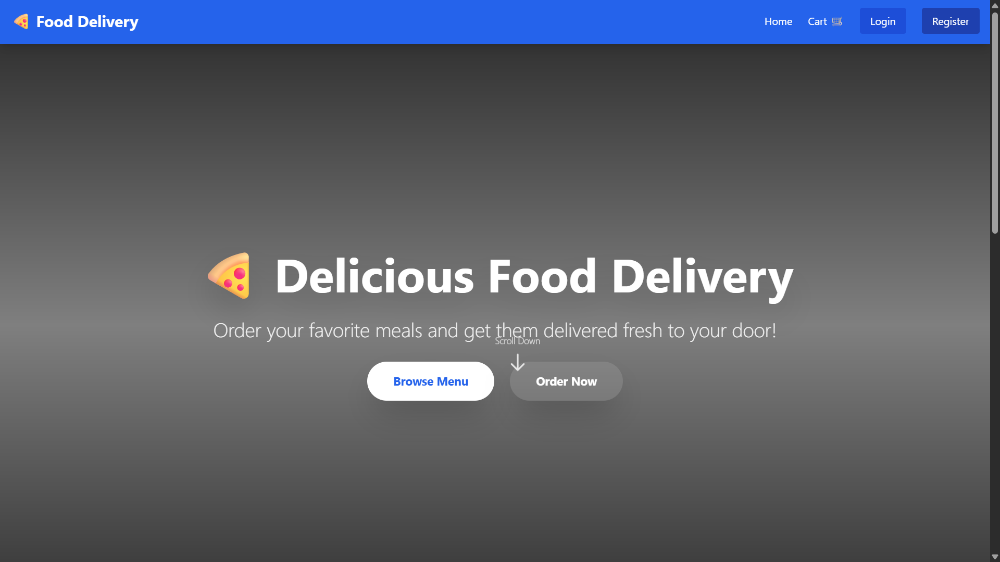

## 📸 Frontend Screenshots

| Home Page | Food Menu |
|----------|-----------|
|  |  |

# 🍔 QuickBite – Online Food Ordering System

QuickBite is a **full-stack online food ordering web application** developed as a college-level project using **Django REST Framework** and **React (Vite)**.  
The project demonstrates real-world concepts such as REST APIs, frontend–backend integration, authentication, and cloud deployment.

---

## 🌐 Live Project Links

🔗 **Backend (Render):**  
https://quickbite-food-backend-wzem.onrender.com  

🔗 **Food API Endpoint:**  
https://quickbite-food-backend-wzem.onrender.com/api/foods/

🔗 **Frontend:**  
https://quickbite-food-delivery.netlify.app/

## 🎯 Project Objectives

- To design and develop a **scalable food ordering system**
- To understand **REST API architecture**
- To integrate frontend with backend APIs
- To deploy a real-world application on the cloud
- To gain hands-on experience in full-stack development

## ✨ Features

- 🍽️ Display food menu (public access)
- 🖼️ Food items with images and descriptions
- 🛒 Add food items to cart
- 🔐 User authentication (Register / Login)
- 📦 Order placement
- 🧑‍💼 Admin panel for managing food items
- ☁️ Backend deployed on Render
- 📱 Responsive and user-friendly interface

## 🛠️ Technology Stack

### Frontend
- React (Vite)
- Tailwind CSS
- Axios
- JavaScript (ES6)

### Backend
- Django
- Django REST Framework
- PostgreSQL (Render)
- Django CORS Headers

